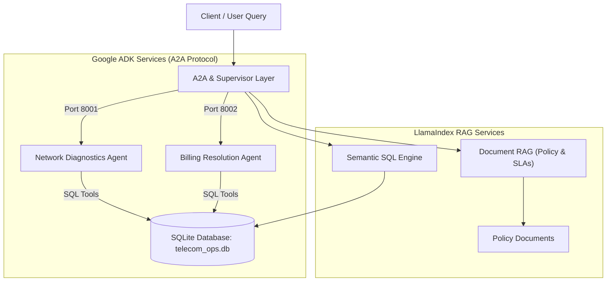

# Telecom Agentic AI Operations Center (Phase 2)

An intelligent, multi-agent operations platform for telecommunications providers. This platform automates customer support, billing dispute resolution, network diagnostics, and policy exploration using **Google Agent Development Kit (ADK)**, the **Agent-to-Agent (A2A) protocol**, and **LlamaIndex RAG**.

---

## Table of Contents

1. [Project Overview](#project-overview)
2. [System Architecture](#system-architecture)
3. [Core Components](#core-components)
   - [Billing Resolution Service (ADK / A2A)](#1-billing-resolution-service-port-8002)
   - [Network Diagnostics Service (ADK / A2A)](#2-network-diagnostics-service-port-8001)
   - [LlamaIndex Document RAG](#3-llamaindex-document-rag)
   - [LlamaIndex Semantic SQL](#4-llamaindex-semantic-sql)
4. [Database Design](#database-design)
5. [Prerequisites & Environment Configuration](#prerequisites--environment-configuration)
   - [Python & System Requirements](#python--system-requirements)
   - [Critical Dependency Alignment](#critical-dependency-alignment)
   - [Environment Variables (.env)](#environment-variables-env)
6. [How to Run the Services](#how-to-run-the-services)
   - [Starting the Services](#starting-the-services)
   - [Verifying Agent Cards](#verifying-agent-cards)
   - [Testing the Billing Resolution Agent](#testing-the-billing-resolution-agent)
7. [Directory Structure](#directory-structure)

---

## Project Overview

In traditional telecom operations, addressing customer issues requires cross-referencing multiple siloed systems:
- Checking billing systems for double charges or disputed invoices.
- Querying network telemetry for tower outages or degradation.
- Searching policy documents for refund rules, service level agreements (SLAs), and roaming caps.

The **Agentic AI Operations Center** coordinates specialized agents that interact directly with database backends, document stores, and external protocols to resolve real-world telecom inquiries accurately without hallucinating data.

---

## System Architecture



---

## Core Components

### 1. Billing Resolution Service (Port 8002)
- **Framework:** Google ADK `2.10.0` exposed via `to_a2a` on `http://localhost:8002`.
- **Model:** Claude Sonnet (`anthropic/claude-sonnet-4-5-20250929`) orchestrated via `LiteLLM`.
- **Location:** `adk-services/billing_resolution/`
- **Capabilities:**
  - `lookup_billing_account(customer_id)`: Fetches account details, balance, and recent charges.
  - `check_duplicate_charges(customer_id)`: Identifies duplicate transactions flagged with `is_duplicate_flag = 1`.
  - `apply_billing_credit(customer_id, amount, reason)`:
    - **Policy Rule:** Credits **≤ $50.00** are automatically marked as `APPLIED` and immediately deducted from the customer's balance.
    - **Policy Rule:** Credits **> $50.00** are saved with status `PENDING_APPROVAL` and require manual review.

### 2. Network Diagnostics Service (Port 8001)
- **Framework:** Google ADK `2.10.0` exposed via `to_a2a` on `http://localhost:8001`.
- **Model:** Claude Sonnet (`anthropic/claude-sonnet-4-5-20250929`) orchestrated via `LiteLLM`.
- **Location:** `adk-services/network_diagnostics/`
- **Capabilities:**
  - `check_tower_status(tower_id)`: Inspects operational health, congestion, and alerts for a cell tower.
  - `run_connectivity_diagnostics(customer_id)`: Correlates user connection issues with connected towers.
  - `get_regional_network_summary(region)`: Reports uptime, throughput, and active incidents across regions.

### 3. LlamaIndex Document RAG
- **Script:** `llamaindex_rag/document_rag.py`
- **Purpose:** Answers questions on refund limits, customer dispute workflows, roaming terms, and SLA response times from ingested telecom policy documents using vector embeddings.

### 4. LlamaIndex Semantic SQL
- **Script:** `llamaindex_rag/sql_semantic_search.py`
- **Purpose:** Translates high-level natural language analytics questions into SQL queries across the network metrics and tower performance logs.

---

## Database Design

The relational backend is SQLite, stored at:
```
data/telecom_ops.db
```

Initialized with scripts located in `sql/`:
- `sql/01_schema.sql`: Table definitions and constraints.
- `sql/02_seed_data.sql`: Realistic synthetic data for customers, accounts, charges, and cell towers.

### Key Billing Tables
| Table | Description |
|---|---|
| `billing_accounts` | Customer account IDs, status, balance, and currency. |
| `billing_charges` | Historical and current charges, invoice status, and duplicate flags. |
| `billing_credits` | Credits issued, amount, reason, and approval status (`APPLIED` / `PENDING_APPROVAL`). |
| `billing_disputes` | Formal dispute cases filed by customers. |

---

## Prerequisites & Environment Configuration

### Python & System Requirements
- **Python Version:** Python 3.13
- **Network / SSL:** Corporate proxy environments are supported out of the box via `truststore`.

### Critical Dependency Alignment

Google ADK `2.10.0` imposes specific constraints on OpenTelemetry:
- Requires `opentelemetry-api >= 1.39, <= 1.42.1` and `opentelemetry-sdk >= 1.39, <= 1.42.1`.
- Newer versions of `google-api-core` (≥ 2.36) require `opentelemetry-api >= 1.44.0`, which creates a version conflict with ADK.
- **Solution:** We pin `google-api-core==2.34.0`, which does not impose the higher OpenTelemetry constraint and is fully supported by `a2a-sdk >= 1.26.0`.

All compatible versions are locked in [`requirements.txt`](file:///D:/Prodapt_Phase_2/requirements.txt):
```text
google-adk==2.10.0
a2a-sdk==1.2.0
uvicorn==0.51.0
fastapi==0.139.2
litellm==1.103.0
truststore==0.10.4
python-dotenv==1.2.3
google-api-core==2.34.0
opentelemetry-api==1.42.1
opentelemetry-sdk==1.42.1
opentelemetry-semantic-conventions==0.63b1
opentelemetry-proto==1.42.1
opentelemetry-exporter-otlp-proto-common==1.42.1
opentelemetry-exporter-otlp-proto-grpc==1.42.1
protobuf==6.33.6
```

To install or verify dependencies:
```powershell
pip install -r requirements.txt
pip check
```

### Environment Variables (`.env`)
Create a `.env` file in the root project folder:
```dotenv
ANTHROPIC_API_KEY=your_anthropic_api_key
GOOGLE_API_KEY=your_google_api_key
NVIDIA_API_KEY=your_nvidia_api_key
```

---

## How to Run the Services

### Starting the Services

Open PowerShell in `D:\Prodapt_Phase_2\adk-services`:

#### 1. Start the Billing Resolution Service (Port 8002)
```powershell
cd D:\Prodapt_Phase_2\adk-services
uvicorn billing_resolution.a2a_server:app --host 0.0.0.0 --port 8002
```

#### 2. Start the Network Diagnostics Service (Port 8001)
```powershell
cd D:\Prodapt_Phase_2\adk-services
uvicorn network_diagnostics.a2a_server:app --host 0.0.0.0 --port 8001
```

---

### Verifying Agent Cards

Once the services are running, verify their discovery cards via browser or curl:

- **Billing Resolution Agent Card:**
  ```powershell
  curl http://localhost:8002/.well-known/agent-card.json
  ```
  Expected: **HTTP 200** with skills for `lookup_billing_account`, `check_duplicate_charges`, and `apply_billing_credit`.

- **Network Diagnostics Agent Card:**
  ```powershell
  curl http://localhost:8001/.well-known/agent-card.json
  ```
  Expected: **HTTP 200** with skills for `check_tower_status`, `run_connectivity_diagnostics`, and `get_regional_network_summary`.

---

### Testing the Billing Resolution Agent

#### 1. Individual Tool Tests
Run any of the standalone test scripts in `adk-services/`:
```powershell
python test_billing_tool.py
python test_duplicate_tool.py
python test_credit_tool.py
```

#### 2. End-to-End A2A Client Request
You can interact with the running A2A service on port 8002 using ADK's `RemoteA2aAgent`:

```python
import asyncio
from google.genai.types import Content, Part
from google.adk.runners import InMemoryRunner
from google.adk.a2a.agent import RemoteA2aAgent

async def test_agent():
    remote_agent = RemoteA2aAgent(
        name="billing_client",
        agent_card="http://localhost:8002/.well-known/agent-card.json",
    )
    runner = InMemoryRunner(agent=remote_agent)
    session = await runner.session_service.create_session(
        app_name=runner.app_name, user_id="user1"
    )

    query = "Customer CUST-10002 was charged twice. Check the account and duplicate charges."
    message = Content(role="user", parts=[Part.from_text(text=query)])

    async for event in runner.run_async(
        session_id=session.id, user_id="user1", new_message=message
    ):
        if event.content and event.content.parts:
            for part in event.content.parts:
                if part.text:
                    print(part.text)

asyncio.run(test_agent())
```

The agent will execute `lookup_billing_account` and `check_duplicate_charges` against `telecom_ops.db` and report the duplicate charge (`CHG-50022` for $65.99) with full factual grounding.

---

## Directory Structure

```text
D:\Prodapt_Phase_2\
├── .env                              # API keys (Anthropic, Google, Nvidia)
├── requirements.txt                  # Pinned compatible dependencies
├── README.md                         # Project documentation
│
├── adk-services/                     # Google ADK microservices
│   ├── billing_resolution/           # Billing dispute resolution service
│   │   ├── __init__.py
│   │   ├── a2a_server.py             # A2A entrypoint (port 8002)
│   │   ├── agent.py                  # Agent definition & LiteLLM config
│   │   └── tools.py                  # SQL-backed async tools
│   ├── network_diagnostics/          # Network diagnostics service
│   │   ├── __init__.py
│   │   ├── a2a_server.py             # A2A entrypoint (port 8001)
│   │   ├── agent.py                  # Agent definition & LiteLLM config
│   │   └── tools.py                  # SQL-backed async tools
│   ├── test_billing_tool.py          # Standalone test for lookup_billing_account
│   ├── test_duplicate_tool.py        # Standalone test for check_duplicate_charges
│   └── test_credit_tool.py           # Standalone test for apply_billing_credit
│
├── data/
│   └── telecom_ops.db                # SQLite database with telecom data
│
├── llamaindex_rag/
│   ├── document_rag.py               # Document RAG over telecom policies/SLAs
│   └── sql_semantic_search.py        # Semantic natural language SQL queries
│
└── sql/
    ├── 01_schema.sql                 # Database table DDL
    └── 02_seed_data.sql              # Database initial records & sample data
```